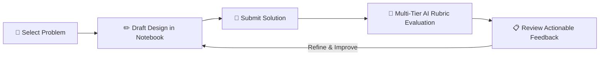
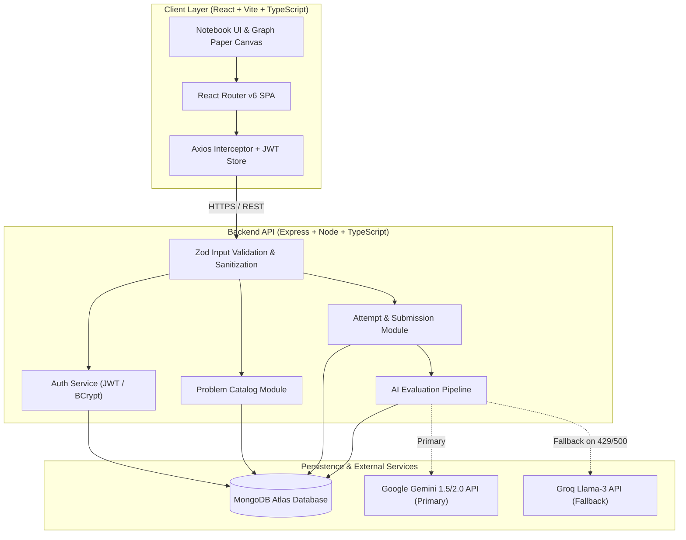
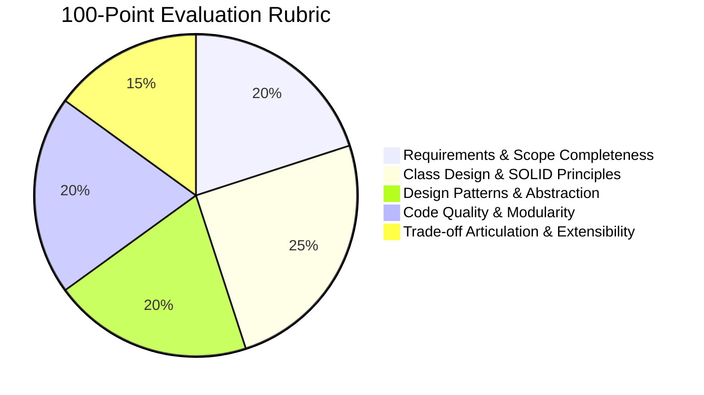

# 📓 LLD Practice Notebook
> *"Everyone starts somewhere. Practice designing systems, learn from trade-offs, try again."*

[](https://lldtaskcipherschools-q5xynnjo8-achyutpandey1212-5961s-projects.vercel.app)
[](https://cipherschools-backend-d1xv.onrender.com/api/health)
[](https://www.typescriptlang.org/)
[](https://react.dev/)
[](https://www.mongodb.com/)
[](https://ai.google.dev/)

---

### 🌐 Live Deployments

| Service | Platform | Live URL |
| :--- | :--- | :--- |
| **Frontend Web App** | Vercel | [lldtaskcipherschools.vercel.app](https://lldtaskcipherschools-q5xynnjo8-achyutpandey1212-5961s-projects.vercel.app) |
| **Backend REST API** | Render | [cipherschools-backend-d1xv.onrender.com](https://cipherschools-backend-d1xv.onrender.com) |
| **System Health Check** | Render | [`/api/health`](https://cipherschools-backend-d1xv.onrender.com/api/health) |

---

## 📌 Table of Contents

- [The Vision & Learning Loop](#-the-vision--learning-loop)
- [Key Features](#-key-features)
- [System Architecture](#-system-architecture)
- [AI Evaluation Engine & Rubric](#-ai-evaluation-engine--rubric)
- [Tech Stack](#-tech-stack)
- [Directory Structure](#-directory-structure)
- [Local Development Setup](#-local-development-setup)
- [API Reference](#-api-reference)
- [Engineering Highlights & Resilience](#-engineering-highlights--resilience)

---

## 💡 The Vision & Learning Loop

Low-Level Design (LLD) is rarely mastered by reading theoretical diagrams alone. Real intuition comes from writing classes, feeling where responsibilities blur, hitting rigid abstractions, and fixing them.

Most platforms only judge whether code runs. **LLD Practice Notebook** judges **how the system is designed**:
- Did you follow SOLID principles?
- Are responsibilities separated cleanly?
- Did you choose appropriate patterns without over-engineering?
- How well does the solution handle future requirement shifts?



---

## ✨ Key Features

- **📓 Handcrafted Scrapbook Aesthetic**: A distraction-free UI inspired by real engineering notebooks — graph paper textures, washi tape accents, stamped status badges, and clean typography.
- **⚡ Dual-Mode Workspace**: Draft your solution with split-pane problem requirements, rich code editing, and design notes (supporting class diagrams & trade-off justifications).
- **🎯 5-Dimensional Evaluation**: Instant, rubric-grounded feedback evaluating class hierarchy, design patterns, maintainability, and trade-offs.
- **🔄 Versioned Attempt History**: Track iterations over time. Compare earlier attempts with refined designs to visualize your learning trajectory.
- **🛡️ Resilient AI Pipeline**: High-availability AI evaluation pipeline featuring primary model inference (**Google Gemini Flash**) with automatic multi-model fallback (**Groq / Llama-3**).
- **🔒 Secure Authentication**: Industry-standard JWT authentication with salted BCrypt password hashing and atomic user sessions.

---

## 🏗️ System Architecture



---

## 🎯 AI Evaluation Engine & Rubric

Every submission passes through a structured, multi-dimensional evaluation rubric that scores designs out of 100 points:



| Criterion | Weight | What We Evaluate |
| :--- | :---: | :--- |
| **Requirements & Scope** | `20 pts` | Does the design satisfy functional requirements and respect boundary constraints? |
| **Class Design & SOLID** | `25 pts` | Single responsibility, open-closed interfaces, proper encapsulation, loose coupling. |
| **Design Patterns** | `20 pts` | Purposeful application of patterns (Strategy, Factory, Observer, etc.) without over-engineering. |
| **Code Modularity** | `20 pts` | Naming conventions, error management, type safety, and clean cohesion. |
| **Trade-offs & Extensibility** | `15 pts` | Clear rationale for structural decisions and how easily the system adapts to change. |

---

## 🛠️ Tech Stack

### Frontend
- **Framework**: [React 18](https://react.dev/) + [Vite](https://vitejs.dev/)
- **Language**: [TypeScript](https://www.typescriptlang.org/)
- **Routing**: [React Router v6](https://reactrouter.com/)
- **HTTP Client**: [Axios](https://axios-http.com/)
- **Styling**: Handcrafted CSS system (Notebook graph paper grid, brutalist scrapbook components, tape & badge elements)

### Backend
- **Runtime**: [Node.js](https://nodejs.org/) (v18+)
- **Server Framework**: [Express.js](https://expressjs.com/)
- **Language**: [TypeScript](https://www.typescriptlang.org/)
- **Validation**: [Zod](https://zod.dev/) (Strict type-safe schemas for every endpoint)
- **Security**: [CORS](https://www.npmjs.com/package/cors), [BCrypt.js](https://www.npmjs.com/package/bcryptjs), [JSONWebToken](https://jwt.io/)

### Database & Cloud
- **Database**: [MongoDB Atlas](https://www.mongodb.com/atlas) with [Mongoose ODM](https://mongoosejs.com/)
- **Hosting**:
  - Frontend: [Vercel](https://vercel.com/) (Edge CDN with SPA route rewrites)
  - Backend: [Render](https://render.com/) (Isolated Node Web Service with auto-deploy)
- **AI Providers**: Google Gemini Flash + Groq API

---

## 📂 Directory Structure

```text
├── client/                     # Frontend Application
│   ├── public/                 # Static assets
│   ├── src/
│   │   ├── components/         # Scrapbook UI components (Navbar, Tape, Stamps, Badges)
│   │   ├── context/            # AuthContext & global state
│   │   ├── pages/              # Landing, Notebook, Workspace, History, Auth
│   │   ├── services/           # Axios API services
│   │   ├── types/              # Frontend TypeScript definitions
│   │   ├── App.tsx             # Route definitions
│   │   └── main.tsx            # App entry point
│   ├── vercel.json             # Vercel SPA routing configuration
│   └── package.json
│
├── server/                     # Backend Application
│   ├── src/
│   │   ├── config/             # Environment, DB, and AI provider configs
│   │   ├── middleware/         # Auth guards, error handlers, request loggers
│   │   ├── modules/
│   │   │   ├── auth/           # Registration, login, JWT token management
│   │   │   ├── problems/       # Problem catalog and seed datasets
│   │   │   ├── attempts/       # Draft saving and submission lifecycle
│   │   │   └── evaluations/    # AI rubric prompt engine & scoring
│   │   ├── scripts/            # Database seed scripts
│   │   ├── app.ts              # Express application setup & CORS
│   │   └── server.ts           # HTTP server bootstrap & graceful shutdown
│   └── package.json
│
└── Docs/                       # Comprehensive System Documentation
    ├── Architecture.md         # Detailed system design
    ├── Evaluation_Rubric.md    # Rubric specification & scoring logic
    └── Product_Direction.md    # Product vision & UX philosophy
```

---

## 🚀 Local Development Setup

### 1. Prerequisites
- **Node.js**: v18.0.0 or higher
- **npm**: v9.0.0 or higher
- **MongoDB**: Local MongoDB instance or free [MongoDB Atlas](https://www.mongodb.com/atlas) cluster

### 2. Clone Repository & Install Dependencies
```bash
git clone https://github.com/your-username/lld-practice-platform.git
cd lld-practice-platform

# Install root, backend, and frontend dependencies in one command
npm run install:all
```

### 3. Configure Environment Variables

#### Backend (`server/.env`)
```env
NODE_ENV=development
PORT=5000
MONGODB_URI=mongodb://localhost:27017/lld-practice
CLIENT_URL=http://localhost:5173
JWT_SECRET=super_secret_jwt_key_at_least_32_characters_long

# AI Provider Keys
GEMINI_API_KEY=your_gemini_api_key
GEMINI_PRIMARY_MODEL=gemini-1.5-flash
GROQ_API_KEY=your_optional_groq_api_key
```

#### Frontend (`client/.env`)
```env
VITE_API_URL=http://localhost:5000
```

### 4. Seed the Database
Populate your database with curated LLD practice challenges (Parking Lot, Elevator System, Rate Limiter, etc.):
```bash
cd server
npm run db:seed
```

### 5. Launch the Development Environment
Run both backend and frontend concurrently with one command from the project root:
```bash
npm run dev
```

- **Frontend**: `http://localhost:5173`
- **Backend API**: `http://localhost:5000`
- **Health Check**: `http://localhost:5000/api/health`

---

## 📡 API Reference

### Health
- `GET /api/health` — Verifies server uptime and database connectivity.

### Authentication
- `POST /api/auth/register` — Create a new learner account.
- `POST /api/auth/login` — Authenticate and receive a JWT Bearer token.
- `GET /api/auth/me` — Retrieve the currently authenticated user profile.

### Problems
- `GET /api/problems` — List all available LLD challenges with difficulty filters.
- `GET /api/problems/:id` — Retrieve problem description, requirements, and constraints.

### Practice Attempts
- `POST /api/attempts` — Initialize or update an attempt draft.
- `GET /api/attempts/user` — Fetch user's attempt history with latest statuses.
- `GET /api/attempts/:id` — Retrieve a specific attempt with code and design notes.
- `POST /api/attempts/:id/submit` — Submit an attempt for automated AI rubric evaluation.

### Evaluations
- `GET /api/evaluations/attempt/:attemptId` — Retrieve detailed scorecard, sub-scores, and actionable critique.

---

## 🛡️ Engineering Highlights & Resilience

1. **Self-Healing CORS Engine**:
   The backend intelligently parses allowed origins, strips accidental trailing slashes, and dynamically validates Vercel preview environments (`*.vercel.app`) to ensure seamless deployments.
2. **AI Provider Fallback Circuit**:
   If the primary Google Gemini model experiences upstream rate limiting (`429`) or service hiccups, the evaluation pipeline automatically reroutes the prompt payload to backup LLM providers without user disruption.
3. **Strict Type-Safety End-to-End**:
   TypeScript interfaces are mirrored across client and server with Zod runtime schemas safeguarding all incoming payload boundaries.
4. **Graceful Server Teardown**:
   Listens for `SIGINT` and `SIGTERM` signals to cleanly drain active HTTP connections and safely disconnect database sockets before shutdown.

---

<div align="center">
  <sub>Crafted with care for engineers who love clean software design.</sub>
</div>
